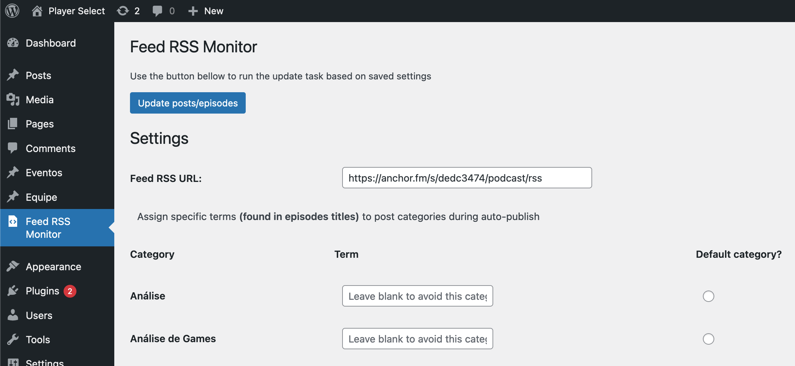

# One WP Feed RSS Monitor
Monitor and auto-publish podcast episodes as wordpress posts

## Installation
- Download the source code <code>.zip</code> file from the last [release](https://github.com/victorandeloci/one-wp-feed-rss-monitor/releases)
- Install and activate it through **WordPress Dashboard**. Go to *Menu -> Plugins -> Add New -> Upload Plugin*
- Update Feed and Categories settings in *Menu -> Feed RSS Monitor*

## Info
<code>Feed RSS URL</code>: URL of RSS feed to be monitored  
<code>Category term</code>: This keyword will be **searched** on new episodes titles. If there's a match, the post will be registered on this category  
<code>Default category</code>: All new episodes found will be registered on this category  
